# Python JSON libraries benchmark

## JSON dumps

### fake-512b.json

| callee       |   elapsed |   ratio |
|:-------------|----------:|--------:|
| orjson       |  0.499733 | 1       |
| ujson        |  0.956588 | 1.9142  |
| rapidjson    |  1.27801  | 2.55739 |
| rapidjson(n) |  1.27924  | 2.55984 |
| hyperjson    |  1.48591  | 2.9734  |
| builtin      |  1.75281  | 3.50749 |

### fake-5kb.json

| callee       |   elapsed |   ratio |
|:-------------|----------:|--------:|
| orjson       |  0.406524 | 1       |
| ujson        |  0.754678 | 1.85642 |
| hyperjson    |  0.996872 | 2.45218 |
| rapidjson(n) |  1.24306  | 3.05778 |
| rapidjson    |  1.27708  | 3.14146 |
| builtin      |  1.37305  | 3.37754 |

### fake-1mb.json

| callee       |   elapsed |   ratio |
|:-------------|----------:|--------:|
| orjson       |  0.554202 | 1       |
| ujson        |  0.968093 | 1.74682 |
| hyperjson    |  1.42418  | 2.56979 |
| rapidjson(n) |  1.58954  | 2.86816 |
| rapidjson    |  1.63238  | 2.94546 |
| builtin      |  2.33727  | 4.21736 |

### apache.json

| callee       |   elapsed |   ratio |
|:-------------|----------:|--------:|
| orjson       |  0.629915 | 1       |
| hyperjson    |  1.82538  | 2.89782 |
| ujson        |  1.85414  | 2.94348 |
| rapidjson    |  1.88337  | 2.98988 |
| rapidjson(n) |  1.88525  | 2.99287 |
| builtin      |  2.94369  | 4.67316 |

### canada.json

| callee       |   elapsed |    ratio |
|:-------------|----------:|---------:|
| orjson       |  0.495562 |  1       |
| hyperjson    |  0.997357 |  2.01258 |
| ujson        |  1.69461  |  3.41958 |
| rapidjson(n) |  5.47749  | 11.0531  |
| rapidjson    |  5.49845  | 11.0954  |
| builtin      |  5.63927  | 11.3795  |

### ctm.json

| callee       |   elapsed |   ratio |
|:-------------|----------:|--------:|
| orjson       |  0.992005 | 1       |
| rapidjson(n) |  1.74665  | 1.76073 |
| rapidjson    |  2.18218  | 2.19977 |
| ujson        |  2.30588  | 2.32446 |
| hyperjson    |  3.11334  | 3.13843 |
| builtin      |  4.22117  | 4.25519 |

### github.json

| callee       |   elapsed |   ratio |
|:-------------|----------:|--------:|
| orjson       |  0.570192 | 1       |
| hyperjson    |  1.3892   | 2.43637 |
| ujson        |  1.39381  | 2.44446 |
| rapidjson(n) |  1.58935  | 2.78739 |
| rapidjson    |  1.62478  | 2.84953 |
| builtin      |  2.18464  | 3.83141 |

### instruments.json

| callee       |   elapsed |   ratio |
|:-------------|----------:|--------:|
| orjson       |  0.786712 | 1       |
| rapidjson(n) |  2.01107  | 2.55629 |
| ujson        |  2.32475  | 2.95502 |
| rapidjson    |  2.45303  | 3.11808 |
| hyperjson    |  3.47484  | 4.41692 |
| builtin      |  4.01021  | 5.09743 |

### mesh.json

| callee       |   elapsed |   ratio |
|:-------------|----------:|--------:|
| orjson       |  0.455774 | 1       |
| ujson        |  0.955233 | 2.09585 |
| hyperjson    |  1.08532  | 2.38126 |
| rapidjson(n) |  2.65283  | 5.82049 |
| rapidjson    |  2.86774  | 6.29202 |
| builtin      |  2.9505   | 6.4736  |

### truenull.json

| callee       |   elapsed |    ratio |
|:-------------|----------:|---------:|
| orjson       |  0.148107 |  1       |
| rapidjson    |  0.31453  |  2.12367 |
| rapidjson(n) |  0.320403 |  2.16333 |
| builtin      |  0.491474 |  3.31838 |
| ujson        |  0.547112 |  3.69404 |
| hyperjson    |  3.21812  | 21.7284  |

### tweet.json

| callee       |   elapsed |   ratio |
|:-------------|----------:|--------:|
| orjson       |  0.502274 | 1       |
| ujson        |  1.41528  | 2.81775 |
| rapidjson(n) |  1.50031  | 2.98704 |
| rapidjson    |  1.50912  | 3.00458 |
| builtin      |  2.19348  | 4.3671  |
| hyperjson    |  2.35034  | 4.67939 |

### twitter.json

| callee       |   elapsed |   ratio |
|:-------------|----------:|--------:|
| orjson       |  0.772852 | 1       |
| ujson        |  1.67792  | 2.17108 |
| rapidjson(n) |  1.82739  | 2.36448 |
| rapidjson    |  1.90073  | 2.45936 |
| hyperjson    |  2.51035  | 3.24816 |
| builtin      |  2.59461  | 3.35718 |

### Summary

| callee       |    mean |   median |
|:-------------|--------:|---------:|
| orjson       | 1       |  1       |
| ujson        | 2.53193 |  2.38446 |
| rapidjson(n) | 3.58096 |  2.82777 |
| hyperjson    | 4.57789 |  2.93561 |
| rapidjson    | 3.73138 |  2.96767 |
| builtin      | 4.82128 |  4.23628 |

## JSON loads

### fake-512b.json

| callee       |   elapsed |   ratio |
|:-------------|----------:|--------:|
| ujson        |   1.07366 | 1       |
| rapidjson(n) |   1.17244 | 1.092   |
| rapidjson    |   1.22949 | 1.14514 |
| orjson       |   1.53646 | 1.43104 |
| hyperjson    |   2.36333 | 2.20119 |
| builtin      |   3.36872 | 3.1376  |

### fake-5kb.json

| callee       |   elapsed |   ratio |
|:-------------|----------:|--------:|
| ujson        |   1.49669 | 1       |
| rapidjson(n) |   1.64586 | 1.09966 |
| orjson       |   1.68428 | 1.12534 |
| rapidjson    |   1.84215 | 1.23081 |
| hyperjson    |   2.62557 | 1.75425 |
| builtin      |   3.79367 | 2.5347  |

### fake-1mb.json

| callee       |   elapsed |   ratio |
|:-------------|----------:|--------:|
| ujson        |   1.98813 | 1       |
| rapidjson(n) |   2.17079 | 1.09187 |
| orjson       |   2.21765 | 1.11544 |
| rapidjson    |   2.33399 | 1.17396 |
| hyperjson    |   3.20157 | 1.61034 |
| builtin      |   4.31349 | 2.16962 |

### apache.json

| callee       |   elapsed |   ratio |
|:-------------|----------:|--------:|
| orjson       |   1.73378 | 1       |
| builtin      |   2.21708 | 1.27875 |
| ujson        |   2.25927 | 1.30309 |
| rapidjson    |   2.56814 | 1.48124 |
| rapidjson(n) |   2.5997  | 1.49944 |
| hyperjson    |   3.0831  | 1.77825 |

### canada.json

| callee       |   elapsed |   ratio |
|:-------------|----------:|--------:|
| orjson       |   1.62322 | 1       |
| rapidjson(n) |   1.62744 | 1.0026  |
| ujson        |   2.08461 | 1.28424 |
| hyperjson    |   2.14488 | 1.32137 |
| builtin      |   3.93968 | 2.42707 |
| rapidjson    |   4.1002  | 2.52596 |

### ctm.json

| callee       |   elapsed |   ratio |
|:-------------|----------:|--------:|
| orjson       |   4.57388 | 1       |
| ujson        |   5.87768 | 1.28505 |
| rapidjson(n) |   6.17932 | 1.351   |
| rapidjson    |   6.92899 | 1.5149  |
| builtin      |   7.02196 | 1.53523 |
| hyperjson    |   8.05174 | 1.76037 |

### github.json

| callee       |   elapsed |   ratio |
|:-------------|----------:|--------:|
| orjson       |   1.34867 | 1       |
| ujson        |   1.75791 | 1.30343 |
| builtin      |   1.84029 | 1.36452 |
| rapidjson(n) |   1.92355 | 1.42625 |
| rapidjson    |   1.98188 | 1.4695  |
| hyperjson    |   2.48691 | 1.84396 |

### instruments.json

| callee       |   elapsed |   ratio |
|:-------------|----------:|--------:|
| orjson       |   2.30303 | 1       |
| ujson        |   3.10792 | 1.34949 |
| rapidjson(n) |   3.32241 | 1.44262 |
| builtin      |   3.902   | 1.69429 |
| rapidjson    |   4.26696 | 1.85276 |
| hyperjson    |   5.21585 | 2.26477 |

### mesh.json

| callee       |   elapsed |   ratio |
|:-------------|----------:|--------:|
| orjson       |  0.563903 | 1       |
| rapidjson(n) |  0.626535 | 1.11107 |
| ujson        |  0.700556 | 1.24233 |
| hyperjson    |  0.960004 | 1.70243 |
| builtin      |  1.1074   | 1.96382 |
| rapidjson    |  1.41312  | 2.50597 |

### truenull.json

| callee       |   elapsed |   ratio |
|:-------------|----------:|--------:|
| ujson        |  0.224341 | 1       |
| orjson       |  0.244418 | 1.08949 |
| rapidjson    |  0.249284 | 1.11118 |
| rapidjson(n) |  0.254347 | 1.13375 |
| builtin      |  0.261114 | 1.16391 |
| hyperjson    |  0.492331 | 2.19457 |

### tweet.json

| callee       |   elapsed |   ratio |
|:-------------|----------:|--------:|
| orjson       |   1.22825 | 1       |
| ujson        |   1.59926 | 1.30206 |
| rapidjson(n) |   1.62635 | 1.32412 |
| rapidjson    |   1.73822 | 1.4152  |
| builtin      |   1.94302 | 1.58194 |
| hyperjson    |   2.86946 | 2.33622 |

### twitter.json

| callee       |   elapsed |   ratio |
|:-------------|----------:|--------:|
| orjson       |   2.22697 | 1       |
| ujson        |   2.656   | 1.19265 |
| builtin      |   3.04015 | 1.36515 |
| rapidjson(n) |   3.21547 | 1.44388 |
| rapidjson    |   3.59227 | 1.61308 |
| hyperjson    |   4.48714 | 2.01491 |

### Summary

| callee       |    mean |   median |
|:-------------|--------:|---------:|
| orjson       | 1.06344 |  1       |
| rapidjson(n) | 1.25152 |  1.22893 |
| ujson        | 1.18853 |  1.26329 |
| rapidjson    | 1.58664 |  1.47537 |
| builtin      | 1.85138 |  1.63811 |
| hyperjson    | 1.89855 |  1.81111 |

# Charts

## JSON dumps

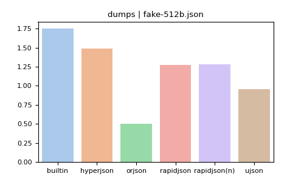
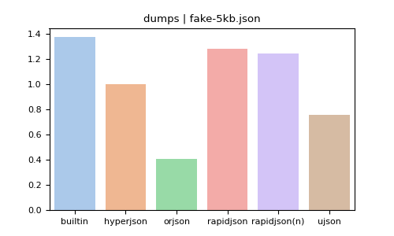
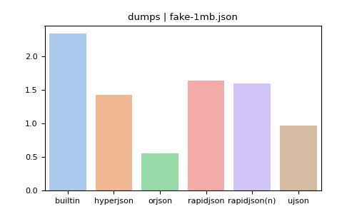
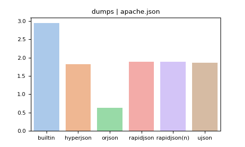
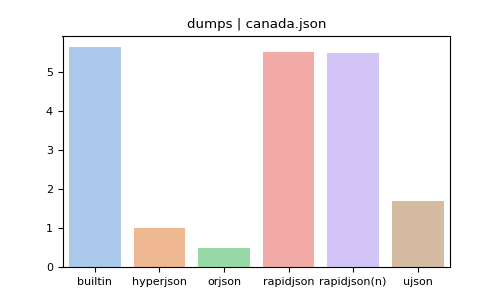
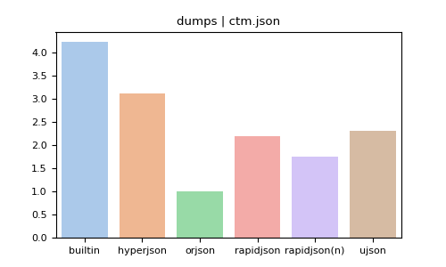

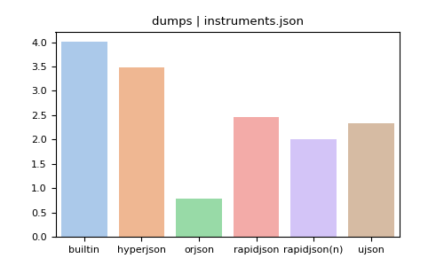

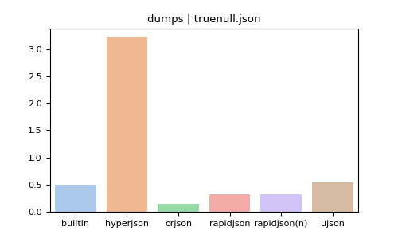
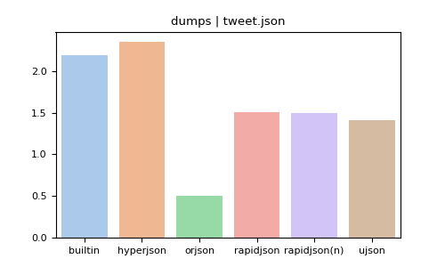

## JSON loads

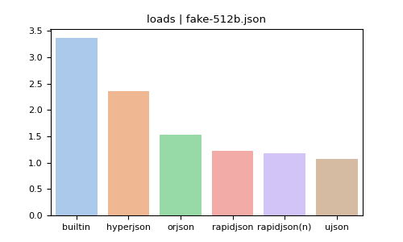
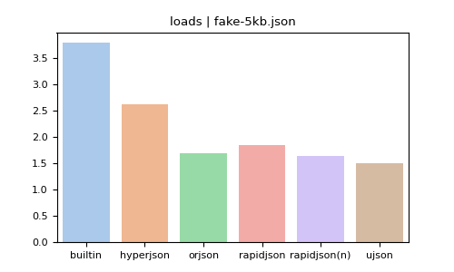

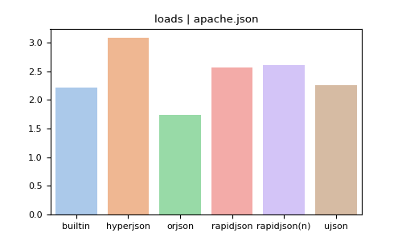

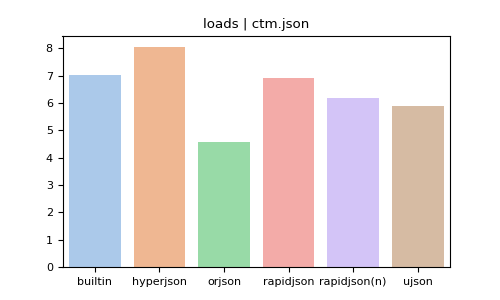
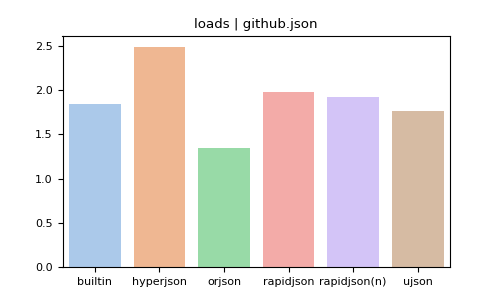
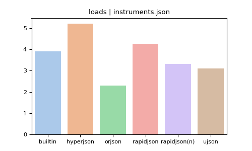
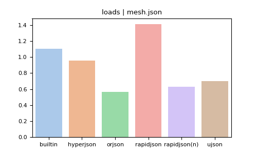
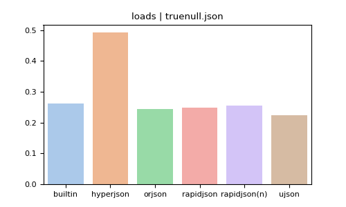
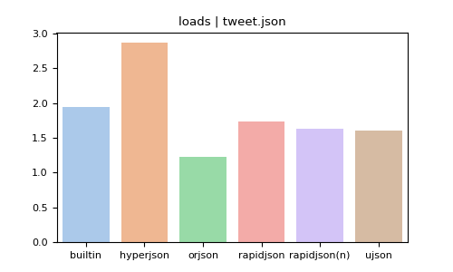
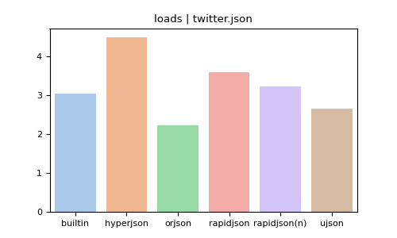
