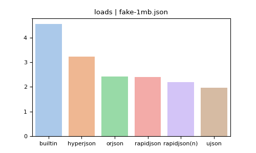
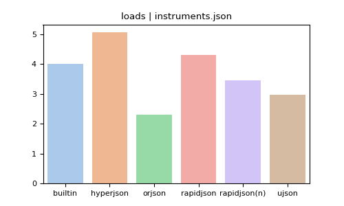
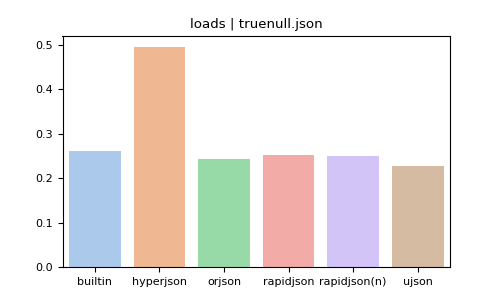

# Python JSON libraries benchmark

## JSON dumps

### fake-512b.json

| callee_name   |   elapsed |   ratio |
|:--------------|----------:|--------:|
| orjson        |  0.473276 | 1       |
| ujson         |  0.879569 | 1.85847 |
| hyperjson     |  1.39849  | 2.95492 |
| rapidjson     |  1.86071  | 3.93155 |
| rapidjson(n)  |  1.89898  | 4.01241 |
| builtin       |  2.25303  | 4.76049 |

### fake-5kb.json

| callee_name   |   elapsed |   ratio |
|:--------------|----------:|--------:|
| orjson        |  0.404353 | 1       |
| ujson         |  0.800402 | 1.97946 |
| hyperjson     |  1.08275  | 2.67774 |
| rapidjson(n)  |  1.29006  | 3.19042 |
| rapidjson     |  1.30772  | 3.23411 |
| builtin       |  1.58975  | 3.93159 |

### fake-1mb.json

| callee_name   |   elapsed |   ratio |
|:--------------|----------:|--------:|
| orjson        |  0.55777  | 1       |
| ujson         |  0.989831 | 1.77462 |
| hyperjson     |  1.25669  | 2.25306 |
| rapidjson(n)  |  1.62855  | 2.91974 |
| rapidjson     |  1.6556   | 2.96825 |
| builtin       |  2.35696  | 4.22568 |

### apache.json

| callee_name   |   elapsed |   ratio |
|:--------------|----------:|--------:|
| orjson        |  0.643859 | 1       |
| rapidjson     |  1.88414  | 2.92632 |
| rapidjson(n)  |  1.88739  | 2.93138 |
| ujson         |  1.91712  | 2.97754 |
| hyperjson     |  1.94463  | 3.02027 |
| builtin       |  2.9655   | 4.60582 |

### canada.json

| callee_name   |   elapsed |    ratio |
|:--------------|----------:|---------:|
| orjson        |  0.527664 |  1       |
| hyperjson     |  0.997849 |  1.89107 |
| ujson         |  1.70171  |  3.22498 |
| rapidjson     |  5.48297  | 10.391   |
| rapidjson(n)  |  5.54573  | 10.51    |
| builtin       |  5.67545  | 10.7558  |

### ctm.json

| callee_name   |   elapsed |   ratio |
|:--------------|----------:|--------:|
| orjson        |   0.9988  | 1       |
| rapidjson(n)  |   1.74767 | 1.74976 |
| rapidjson     |   2.21141 | 2.21406 |
| ujson         |   2.315   | 2.31778 |
| hyperjson     |   3.10726 | 3.11099 |
| builtin       |   4.29246 | 4.29761 |

### github.json

| callee_name   |   elapsed |   ratio |
|:--------------|----------:|--------:|
| orjson        |  0.566375 | 1       |
| ujson         |  1.40717  | 2.48451 |
| hyperjson     |  1.45163  | 2.56301 |
| rapidjson(n)  |  1.59111  | 2.80929 |
| rapidjson     |  1.62674  | 2.87219 |
| builtin       |  2.19684  | 3.87877 |

### instruments.json

| callee_name   |   elapsed |   ratio |
|:--------------|----------:|--------:|
| orjson        |  0.814104 | 1       |
| rapidjson(n)  |  2.05214  | 2.52073 |
| ujson         |  2.34315  | 2.8782  |
| rapidjson     |  2.49675  | 3.06686 |
| hyperjson     |  3.59825  | 4.41989 |
| builtin       |  4.04319  | 4.96643 |

### mesh.json

| callee_name   |   elapsed |   ratio |
|:--------------|----------:|--------:|
| orjson        |  0.43776  | 1       |
| ujson         |  0.982093 | 2.24345 |
| hyperjson     |  1.04956  | 2.39757 |
| rapidjson(n)  |  2.60379  | 5.94799 |
| rapidjson     |  2.85918  | 6.5314  |
| builtin       |  2.93982  | 6.7156  |

### truenull.json

| callee_name   |   elapsed |    ratio |
|:--------------|----------:|---------:|
| orjson        |  0.14982  |  1       |
| rapidjson     |  0.314163 |  2.09693 |
| rapidjson(n)  |  0.317222 |  2.11735 |
| builtin       |  0.484453 |  3.23356 |
| ujson         |  0.538865 |  3.59674 |
| hyperjson     |  3.18511  | 21.2595  |

### tweet.json

| callee_name   |   elapsed |   ratio |
|:--------------|----------:|--------:|
| orjson        |  0.501781 | 1       |
| ujson         |  1.42425  | 2.83839 |
| rapidjson(n)  |  1.48957  | 2.96856 |
| rapidjson     |  1.5136   | 3.01646 |
| builtin       |  2.19983  | 4.38404 |
| hyperjson     |  2.36858  | 4.72034 |

### twitter.json

| callee_name   |   elapsed |   ratio |
|:--------------|----------:|--------:|
| orjson        |  0.783495 | 1       |
| ujson         |  1.73375  | 2.21283 |
| rapidjson(n)  |  1.89307  | 2.41618 |
| rapidjson     |  1.95661  | 2.49729 |
| hyperjson     |  2.59704  | 3.31469 |
| builtin       |  2.63347  | 3.36118 |

### Summary

| callee_name   |    mean |   median |
|:--------------|--------:|---------:|
| orjson        | 1       |  1       |
| ujson         | 2.53225 |  2.40115 |
| rapidjson(n)  | 3.67448 |  2.92556 |
| hyperjson     | 4.54859 |  2.98759 |
| rapidjson     | 3.8122  |  2.99236 |
| builtin       | 4.92638 |  4.34083 |

## JSON loads

### fake-512b.json

| callee_name   |   elapsed |   ratio |
|:--------------|----------:|--------:|
| ujson         |  0.804319 | 1       |
| rapidjson(n)  |  0.981083 | 1.21977 |
| rapidjson     |  1.05281  | 1.30895 |
| orjson        |  1.40376  | 1.74528 |
| hyperjson     |  1.97686  | 2.4578  |
| builtin       |  3.47531  | 4.32081 |

### fake-5kb.json

| callee_name   |   elapsed |   ratio |
|:--------------|----------:|--------:|
| ujson         |   1.50261 | 1       |
| rapidjson(n)  |   1.6032  | 1.06694 |
| orjson        |   1.63428 | 1.08762 |
| rapidjson     |   1.7928  | 1.19312 |
| hyperjson     |   2.36933 | 1.57681 |
| builtin       |   4.38159 | 2.91598 |

### fake-1mb.json

| callee_name   |   elapsed |   ratio |
|:--------------|----------:|--------:|
| ujson         |   1.95164 | 1       |
| rapidjson(n)  |   2.04021 | 1.04538 |
| orjson        |   2.12726 | 1.08999 |
| rapidjson     |   2.27856 | 1.16751 |
| hyperjson     |   3.12168 | 1.59952 |
| builtin       |   4.58189 | 2.34772 |

### apache.json

| callee_name   |   elapsed |   ratio |
|:--------------|----------:|--------:|
| orjson        |   1.73101 | 1       |
| builtin       |   2.13914 | 1.23578 |
| ujson         |   2.2302  | 1.28838 |
| rapidjson(n)  |   2.54066 | 1.46773 |
| rapidjson     |   2.62743 | 1.51786 |
| hyperjson     |   3.10076 | 1.7913  |

### canada.json

| callee_name   |   elapsed |   ratio |
|:--------------|----------:|--------:|
| rapidjson(n)  |   1.52759 | 1       |
| orjson        |   1.5634  | 1.02344 |
| ujson         |   2.0459  | 1.33929 |
| hyperjson     |   2.10509 | 1.37804 |
| builtin       |   3.89265 | 2.54822 |
| rapidjson     |   4.03046 | 2.63844 |

### ctm.json

| callee_name   |   elapsed |   ratio |
|:--------------|----------:|--------:|
| orjson        |   4.61497 | 1       |
| ujson         |   5.57674 | 1.2084  |
| rapidjson(n)  |   5.96386 | 1.29228 |
| rapidjson     |   6.87359 | 1.48941 |
| builtin       |   7.17646 | 1.55504 |
| hyperjson     |   7.88272 | 1.70807 |

### github.json

| callee_name   |   elapsed |   ratio |
|:--------------|----------:|--------:|
| orjson        |   1.33526 | 1       |
| ujson         |   1.81755 | 1.36119 |
| builtin       |   1.86248 | 1.39484 |
| rapidjson(n)  |   1.95643 | 1.46521 |
| rapidjson     |   2.02601 | 1.51732 |
| hyperjson     |   2.60756 | 1.95285 |

### instruments.json

| callee_name   |   elapsed |   ratio |
|:--------------|----------:|--------:|
| orjson        |   2.43005 | 1       |
| ujson         |   2.94963 | 1.21381 |
| rapidjson(n)  |   3.37076 | 1.38712 |
| builtin       |   4.01915 | 1.65394 |
| rapidjson     |   4.36644 | 1.79685 |
| hyperjson     |   5.26694 | 2.16742 |

### mesh.json

| callee_name   |   elapsed |   ratio |
|:--------------|----------:|--------:|
| orjson        |  0.541251 | 1       |
| rapidjson(n)  |  0.55749  | 1.03    |
| ujson         |  0.661779 | 1.22268 |
| hyperjson     |  0.871127 | 1.60947 |
| builtin       |  1.0874   | 2.00905 |
| rapidjson     |  1.30779  | 2.41623 |

### truenull.json

| callee_name   |   elapsed |   ratio |
|:--------------|----------:|--------:|
| ujson         |  0.225518 | 1       |
| orjson        |  0.238425 | 1.05723 |
| rapidjson(n)  |  0.247323 | 1.09668 |
| rapidjson     |  0.250948 | 1.11276 |
| builtin       |  0.257093 | 1.14001 |
| hyperjson     |  0.495177 | 2.19573 |

### tweet.json

| callee_name   |   elapsed |   ratio |
|:--------------|----------:|--------:|
| orjson        |   1.27525 | 1       |
| ujson         |   1.61155 | 1.26371 |
| rapidjson(n)  |   1.61898 | 1.26954 |
| rapidjson     |   1.70108 | 1.33392 |
| builtin       |   1.85939 | 1.45807 |
| hyperjson     |   2.86963 | 2.25026 |

### twitter.json

| callee_name   |   elapsed |   ratio |
|:--------------|----------:|--------:|
| orjson        |   2.31976 | 1       |
| ujson         |   2.72414 | 1.17432 |
| builtin       |   3.20882 | 1.38325 |
| rapidjson(n)  |   3.22017 | 1.38815 |
| rapidjson     |   3.4342  | 1.48041 |
| hyperjson     |   4.56345 | 1.96721 |

### Summary

| callee_name   |    mean |   median |
|:--------------|--------:|---------:|
| orjson        | 1.08363 |  1       |
| ujson         | 1.17265 |  1.21111 |
| rapidjson(n)  | 1.2274  |  1.24466 |
| rapidjson     | 1.58107 |  1.48491 |
| builtin       | 1.99689 |  1.60449 |
| hyperjson     | 1.88787 |  1.87207 |

# Charts

## JSON dumps

## JSON loads

