# Python JSON libraries benchmark

- hyperjson v0.2.4
- orjson v3.2.0
- rapidjson  v0.9.1
- ujson v3.0.0

## JSON dumps

#### fake-512b.json

| callee_name   |   elapsed |   ratio |
|:--------------|----------:|--------:|
| orjson        |    0.4226 |  1.0000 |
| ujson         |    0.7370 |  1.7438 |
| rapidjson     |    1.0284 |  2.4334 |
| rapidjson(n)  |    1.0853 |  2.5680 |
| hyperjson     |    1.0892 |  2.5772 |
| builtin       |    1.4856 |  3.5154 |

#### fake-5kb.json

| callee_name   |   elapsed |   ratio |
|:--------------|----------:|--------:|
| orjson        |    0.4140 |  1.0000 |
| ujson         |    0.8862 |  2.1407 |
| hyperjson     |    1.0997 |  2.6565 |
| rapidjson(n)  |    1.3551 |  3.2734 |
| rapidjson     |    1.3813 |  3.3367 |
| builtin       |    1.6061 |  3.8798 |

#### fake-1mb.json

| callee_name   |   elapsed |   ratio |
|:--------------|----------:|--------:|
| orjson        |    0.5619 |  1.0000 |
| ujson         |    0.9957 |  1.7723 |
| hyperjson     |    1.2603 |  2.2431 |
| rapidjson(n)  |    1.6099 |  2.8654 |
| rapidjson     |    1.6471 |  2.9315 |
| builtin       |    2.3227 |  4.1340 |

#### apache.json

| callee_name   |   elapsed |   ratio |
|:--------------|----------:|--------:|
| orjson        |    0.6360 |  1.0000 |
| hyperjson     |    1.8177 |  2.8582 |
| rapidjson(n)  |    1.8831 |  2.9611 |
| rapidjson     |    1.8835 |  2.9617 |
| ujson         |    1.9042 |  2.9942 |
| builtin       |    2.9560 |  4.6481 |

#### canada.json

| callee_name   |   elapsed |   ratio |
|:--------------|----------:|--------:|
| orjson        |    0.4986 |  1.0000 |
| hyperjson     |    0.9992 |  2.0040 |
| ujson         |    1.7176 |  3.4446 |
| rapidjson(n)  |    5.5233 | 11.0769 |
| rapidjson     |    5.5302 | 11.0908 |
| builtin       |    5.7169 | 11.4653 |

#### ctm.json

| callee_name   |   elapsed |   ratio |
|:--------------|----------:|--------:|
| orjson        |    1.0081 |  1.0000 |
| rapidjson(n)  |    1.7645 |  1.7503 |
| rapidjson     |    2.2429 |  2.2248 |
| ujson         |    2.3506 |  2.3316 |
| hyperjson     |    3.1209 |  3.0958 |
| builtin       |    4.2867 |  4.2521 |

#### github.json

| callee_name   |   elapsed |   ratio |
|:--------------|----------:|--------:|
| orjson        |    0.5736 |  1.0000 |
| hyperjson     |    1.3880 |  2.4198 |
| ujson         |    1.4201 |  2.4758 |
| rapidjson(n)  |    1.6050 |  2.7981 |
| rapidjson     |    1.6461 |  2.8698 |
| builtin       |    2.2910 |  3.9941 |

#### instruments.json

| callee_name   |   elapsed |   ratio |
|:--------------|----------:|--------:|
| orjson        |    0.8074 |  1.0000 |
| rapidjson(n)  |    2.0267 |  2.5100 |
| ujson         |    2.3693 |  2.9343 |
| rapidjson     |    2.4672 |  3.0556 |
| hyperjson     |    3.5087 |  4.3455 |
| builtin       |    4.0396 |  5.0029 |

#### mesh.json

| callee_name   |   elapsed |   ratio |
|:--------------|----------:|--------:|
| orjson        |    0.4365 |  1.0000 |
| ujson         |    0.9487 |  2.1732 |
| hyperjson     |    1.0490 |  2.4031 |
| rapidjson(n)  |    2.6243 |  6.0117 |
| rapidjson     |    2.8687 |  6.5715 |
| builtin       |    2.9848 |  6.8375 |

#### truenull.json

| callee_name   |   elapsed |   ratio |
|:--------------|----------:|--------:|
| orjson        |    0.1478 |  1.0000 |
| rapidjson(n)  |    0.3193 |  2.1602 |
| rapidjson     |    0.3236 |  2.1889 |
| builtin       |    0.5081 |  3.4373 |
| ujson         |    0.5427 |  3.6715 |
| hyperjson     |    3.2354 | 21.8866 |

#### tweet.json

| callee_name   |   elapsed |   ratio |
|:--------------|----------:|--------:|
| orjson        |    0.5104 |  1.0000 |
| ujson         |    1.4380 |  2.8175 |
| rapidjson(n)  |    1.4978 |  2.9346 |
| rapidjson     |    1.5162 |  2.9708 |
| builtin       |    2.2467 |  4.4020 |
| hyperjson     |    2.3282 |  4.5617 |

#### twitter.json

| callee_name   |   elapsed |   ratio |
|:--------------|----------:|--------:|
| orjson        |    0.7977 |  1.0000 |
| ujson         |    1.7136 |  2.1483 |
| rapidjson(n)  |    1.8600 |  2.3319 |
| rapidjson     |    1.9291 |  2.4184 |
| hyperjson     |    2.5542 |  3.2022 |
| builtin       |    2.6380 |  3.3072 |

#### Summary

| callee_name   |   mean |   median |
|:--------------|-------:|---------:|
| orjson        | 1.0000 |   1.0000 |
| ujson         | 2.5540 |   2.4037 |
| hyperjson     | 4.5211 |   2.7574 |
| rapidjson(n)  | 3.6035 |   2.8318 |
| rapidjson     | 3.7545 |   2.9466 |
| builtin       | 4.9063 |   4.1930 |

## JSON loads

#### fake-512b.json

| callee_name   |   elapsed |   ratio |
|:--------------|----------:|--------:|
| ujson         |    1.1690 |  1.0000 |
| rapidjson(n)  |    1.2306 |  1.0527 |
| rapidjson     |    1.3755 |  1.1766 |
| orjson        |    1.6423 |  1.4049 |
| hyperjson     |    2.4283 |  2.0772 |
| builtin       |    3.6664 |  3.1364 |

#### fake-5kb.json

| callee_name   |   elapsed |   ratio |
|:--------------|----------:|--------:|
| ujson         |    1.4905 |  1.0000 |
| rapidjson(n)  |    1.6735 |  1.1228 |
| orjson        |    1.7074 |  1.1455 |
| rapidjson     |    1.7844 |  1.1972 |
| hyperjson     |    2.3176 |  1.5550 |
| builtin       |    3.9665 |  2.6613 |

#### fake-1mb.json

| callee_name   |   elapsed |   ratio |
|:--------------|----------:|--------:|
| ujson         |    1.9728 |  1.0000 |
| rapidjson(n)  |    2.2025 |  1.1165 |
| rapidjson     |    2.3892 |  1.2111 |
| orjson        |    2.4233 |  1.2284 |
| hyperjson     |    3.2271 |  1.6358 |
| builtin       |    4.5504 |  2.3066 |

#### apache.json

| callee_name   |   elapsed |   ratio |
|:--------------|----------:|--------:|
| orjson        |    1.7103 |  1.0000 |
| builtin       |    2.1644 |  1.2655 |
| ujson         |    2.2430 |  1.3115 |
| rapidjson(n)  |    2.5699 |  1.5026 |
| rapidjson     |    2.5832 |  1.5104 |
| hyperjson     |    3.1113 |  1.8192 |

#### canada.json

| callee_name   |   elapsed |   ratio |
|:--------------|----------:|--------:|
| rapidjson(n)  |    1.5725 |  1.0000 |
| orjson        |    1.5801 |  1.0048 |
| ujson         |    2.0640 |  1.3126 |
| hyperjson     |    2.1468 |  1.3652 |
| builtin       |    3.9015 |  2.4811 |
| rapidjson     |    4.0780 |  2.5934 |

#### ctm.json

| callee_name   |   elapsed |   ratio |
|:--------------|----------:|--------:|
| orjson        |    4.6633 |  1.0000 |
| ujson         |    5.8034 |  1.2445 |
| rapidjson(n)  |    6.1857 |  1.3265 |
| rapidjson     |    6.9202 |  1.4840 |
| builtin       |    7.0251 |  1.5065 |
| hyperjson     |    8.1371 |  1.7449 |

#### github.json

| callee_name   |   elapsed |   ratio |
|:--------------|----------:|--------:|
| orjson        |    1.3193 |  1.0000 |
| ujson         |    1.7879 |  1.3551 |
| builtin       |    1.8630 |  1.4121 |
| rapidjson(n)  |    1.9497 |  1.4778 |
| rapidjson     |    2.0244 |  1.5344 |
| hyperjson     |    2.5570 |  1.9381 |

#### instruments.json

| callee_name   |   elapsed |   ratio |
|:--------------|----------:|--------:|
| orjson        |    2.2980 |  1.0000 |
| ujson         |    2.9588 |  1.2876 |
| rapidjson(n)  |    3.4489 |  1.5008 |
| builtin       |    4.0021 |  1.7416 |
| rapidjson     |    4.3025 |  1.8723 |
| hyperjson     |    5.0621 |  2.2029 |

#### mesh.json

| callee_name   |   elapsed |   ratio |
|:--------------|----------:|--------:|
| orjson        |    0.5445 |  1.0000 |
| rapidjson(n)  |    0.5670 |  1.0415 |
| ujson         |    0.6679 |  1.2267 |
| hyperjson     |    0.8871 |  1.6293 |
| builtin       |    1.1040 |  2.0277 |
| rapidjson     |    1.2955 |  2.3795 |

#### truenull.json

| callee_name   |   elapsed |   ratio |
|:--------------|----------:|--------:|
| ujson         |    0.2264 |  1.0000 |
| orjson        |    0.2423 |  1.0702 |
| rapidjson(n)  |    0.2494 |  1.1014 |
| rapidjson     |    0.2512 |  1.1095 |
| builtin       |    0.2619 |  1.1565 |
| hyperjson     |    0.4947 |  2.1848 |

#### tweet.json

| callee_name   |   elapsed |   ratio |
|:--------------|----------:|--------:|
| orjson        |    1.2596 |  1.0000 |
| ujson         |    1.6265 |  1.2913 |
| rapidjson(n)  |    1.6363 |  1.2991 |
| rapidjson     |    1.7055 |  1.3540 |
| builtin       |    1.8269 |  1.4503 |
| hyperjson     |    2.7995 |  2.2225 |

#### twitter.json

| callee_name   |   elapsed |   ratio |
|:--------------|----------:|--------:|
| orjson        |    2.2659 |  1.0000 |
| ujson         |    2.7499 |  1.2136 |
| builtin       |    3.0569 |  1.3491 |
| rapidjson(n)  |    3.2706 |  1.4434 |
| rapidjson     |    3.3837 |  1.4933 |
| hyperjson     |    4.4831 |  1.9785 |

#### Summary

| callee_name   |   mean |   median |
|:--------------|-------:|---------:|
| orjson        | 1.0712 |   1.0000 |
| rapidjson(n)  | 1.2488 |   1.2109 |
| ujson         | 1.1869 |   1.2356 |
| rapidjson     | 1.5763 |   1.4886 |
| builtin       | 1.8746 |   1.6240 |
| hyperjson     | 1.8628 |   1.8787 |

# Charts

## JSON dumps

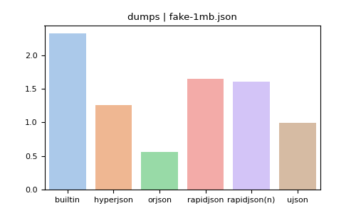
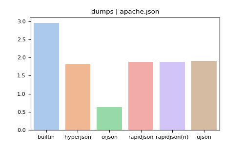
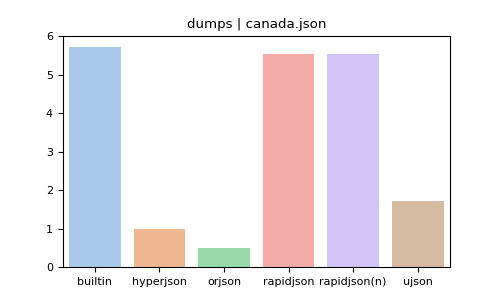

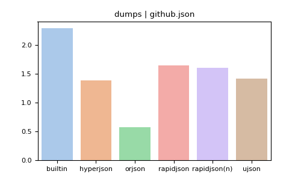

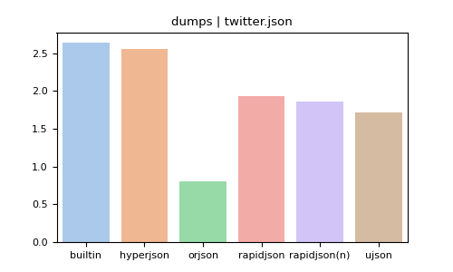

## JSON loads

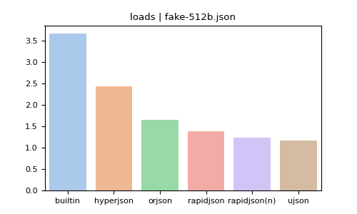
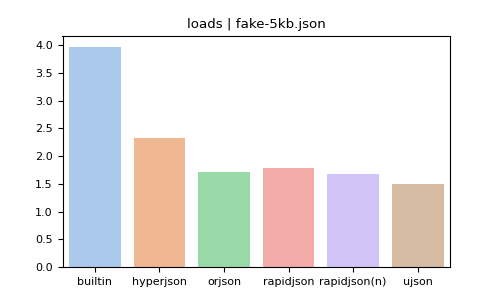

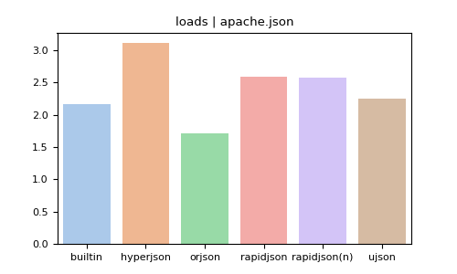
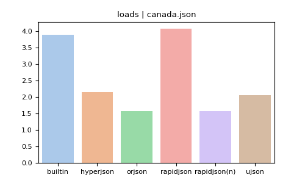
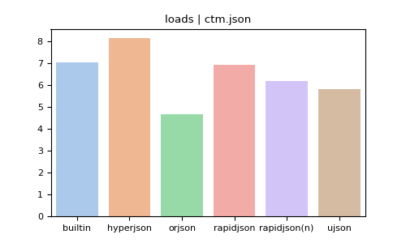

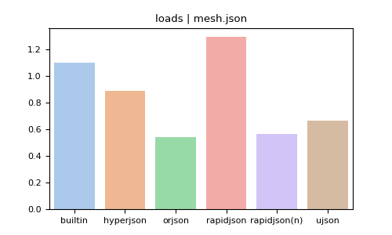

